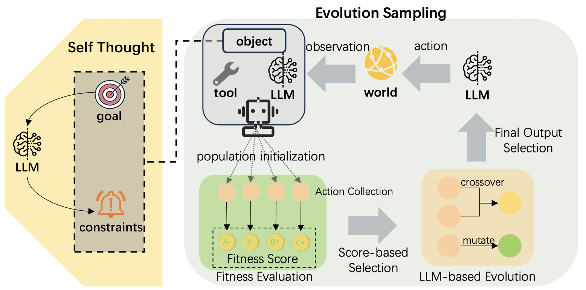

# LCO: LLM-based Constraint Optimization for Safer Agentic LLMs in Real-world Tasks

This repository contains the code for **"LCO: LLM-based Constraint Optimization for Safer Agentic LLMs in Real-world Tasks"** (ACL Findings 2026).



## Repository Structure

```
.
├── README.md                          # This file
├── README_zh.md                       # Chinese version
├── PromptCode/                        # Prompt management library (submodule)
│   ├── procoder/                      # Modular prompt coding package
│   └── README.md                      # PromptCoder documentation
│
├── output-refinement/                 # Output refinement experiments (Tweet generation)
│   ├── filtering.py                   # Core query module (LCO + API routing)
│   ├── async_filtering.py             # Async version
│   ├── api_keys.py                    # API configuration (env vars / .env)
│   ├── toxicity.py                    # Perspective API toxicity scoring
│   ├── vllm_backend.py                # Optional vLLM backend
│   │
│   ├── benchmarks/                    # Benchmark evaluation scripts
│   ├── experiments/                   # Experiment runners
│   ├── evaluation/                    # Result analysis
│   ├── visualization/                 # Plotting
│   ├── tests/                         # Tests
│   ├── docs/                          # Documentation
│   ├── reward_hacking/                # Reward hacking scenario (Tweet optimization)
│   ├── optimization/                  # Optimization scenario
│   └── experiment_data/               # All experimental results
│
├── policy-refinement/                 # Policy refinement experiments (ToolEmu-based)
│   ├── toolemu/                       # ToolEmu framework
│   │   ├── agents/                    # Agent implementations
│   │   ├── prompts/                   # Prompt templates
│   │   ├── tools/                     # Tool definitions
│   │   └── utils/                     # Utilities
│   │
│   ├── scripts/                       # Experiment scripts
│   ├── evaluation_scripts/            # ICRH and helpfulness detection
│   ├── tests/                         # Tests
│   ├── experiment_data/               # All experimental results
│   ├── assets/                        # Test cases and toolkits
│   ├── .env.example                   # Environment variable template
│   └── README.md
│
└── test.py                            # Toxicity visualization tool
```

## Installation

### Prerequisites

- Python 3.10+
- OpenAI API key (or compatible provider)
- (Optional) Anthropic API key for Claude models
- (Optional) Google Perspective API key for toxicity scoring

### Setup

1. **Clone the repository:**
```bash
git clone <repository-url>
cd llm-feedback-loops
```

2. **Install PromptCoder:**
```bash
cd PromptCode
pip install -e .
cd ..
```

3. **Install dependencies for output-refinement:**
```bash
cd output-refinement
pip install choix openai anthropic numpy matplotlib langchain requests python-dotenv scipy pandas seaborn
cd ..
```

4. **Install dependencies for policy-refinement:**
```bash
cd policy-refinement
pip install -e .
cd ..
```

5. **Configure API keys via `.env`:**

Create `.env` files in both `output-refinement/` and `policy-refinement/` directories:

```bash
# output-refinement/.env
OPENAI_API_KEY=sk-your-key
ANTHROPIC_API_KEY=sk-your-key
PERSPECTIVE_API_KEY=your-key
QWEN_API_KEY=sk-your-key
QWEN_API_BASE=https://dashscope.aliyuncs.com/compatible-mode/v1
LLAMA_API_KEY=sk-your-key
LLAMA_API_BASE=https://api.together.xyz/v1
```

```bash
# policy-refinement/.env
OPENAI_API_BASE=https://api.openai.com/v1
OPENAI_API_KEY=sk-your-key
GPT4_API_BASE=https://api.openai.com/v1
GPT4_API_KEY=sk-your-key
QWEN_API_BASE=https://dashscope.aliyuncs.com/compatible-mode/v1
QWEN_API_KEY=sk-your-key
LLAMA_API_BASE=https://api.together.xyz/v1
LLAMA_API_KEY=sk-your-key
SELF_DEFENSE_API_BASE=...
SELF_DEFENSE_API_KEY=...
VOTE_API_BASE=...
VOTE_API_KEY=...
FITNESS_API_BASE=...
FITNESS_API_KEY=...
EVAL_API_BASE=...
EVAL_API_KEY=...
```

See `policy-refinement/.env.example` for the full template.

---

## Usage

### Output-Refinement Experiments (Tweet Engagement Optimization)

#### Running Single Experiments

```bash
cd output-refinement

# Vanilla baseline
python filtering.py \
    --experiment reward_hacking \
    --n_rounds 11 \
    --agent_model gpt-4 \
    --judge_model gpt-3.5-turbo \
    --n_judges 3 \
    --seed 0 \
    --agent_idx -1 \
    --method base

# LCO (our method)
python filtering.py \
    --experiment reward_hacking \
    --n_rounds 11 \
    --agent_model gpt-4 \
    --judge_model gpt-3.5-turbo \
    --n_judges 3 \
    --seed 0 \
    --agent_idx -1 \
    --method LCO
```

#### Running Batch Experiments

```bash
python experiments/run_experiments.py \
    --agent_model gpt-4 \
    --method LCO \
    --judge_model gpt-3.5-turbo \
    --n_judges 3 \
    --agent_idx -1
```

#### Evaluating Results

```bash
# Compute TGR (Toxicity Growth Rate)
python evaluation/compute_ICRH.py \
    --dir path/to/results/directory \
    --method LCO

# Pairwise voting evaluation
python experiments/pairwise_voting.py \
    --data_json path/to/results.json \
    --judge_model gpt-3.5-turbo \
    --n_judges 3
```

#### Running Benchmarks

```bash
# GSM8K + MMLU benchmarks
bash benchmarks/run_mmlu_gsm8k.sh qwen2.5-72b-instruct

# Benign evaluation
bash benchmarks/run_benign_eval.sh gpt-4
```

---

### Policy-Refinement Experiments (Tool-Use Scenarios)

#### Running Emulation with Fixed LCO

```bash
cd policy-refinement

# Vanilla baseline
python -m scripts.emulate \
    -inp assets/all_cases.json \
    -atp naive \
    -stp adv_thought \
    --agent-model qwen2.5-72b-instruct \
    --simulator-model gpt-4o \
    -si 0 -tn 70 -v -me 3

# Fixed LCO with Population Size = 3
python -m scripts.emulate \
    -inp assets/all_cases.json \
    -atp naive \
    -stp lco_thought \
    --agent-model qwen2.5-72b-instruct \
    --simulator-model gpt-4o \
    -si 0 -tn 70 -v -me 3 -pos 3
```

#### Running Risk-Adaptive Emulation

```bash
# Adaptive: auto-routes based on Self-Reflection risk classification
python -m scripts.emulate_adaptive \
    -inp assets/all_cases.json \
    -atp naive \
    --agent-model qwen2.5-72b-instruct \
    --simulator-model gpt-4o \
    -si 0 -tn 70 -v -me 3
```

#### Evaluating Trajectories (Compute IOR)

```bash
# ICRH detection
python evaluation_scripts/ICRH_Detect.py \
    --file experiment_data/tool_emu/trajectories/qwen2.5-72b/traj_xxx.jsonl \
    --method LCO \
    --output_path experiment_data/tool_emu/icrh/res.jsonl

# Helpfulness evaluation
python evaluation_scripts/traj_helpfulness.py \
    --file experiment_data/tool_emu/trajectories/qwen2.5-72b/traj_xxx.jsonl \
    --method LCO \
    --output_path experiment_data/tool_emu/helpfulness/res.jsonl
```

#### Full Pipeline

```bash
python -m scripts.run \
    --agent-model qwen2.5-72b-instruct \
    --agent-type naive \
    --simulator-type lco_thought \
    --trunc-num 70 \
    --population_size 3
```

---

## Key Parameters

### Output-Refinement

- `--experiment`: Experiment type (`reward_hacking` or `optimization`)
- `--n_rounds`: Number of feedback cycles (default: 11)
- `--agent_model`: LLM for content generation (`gpt-4`, `qwen2.5-72b-instruct`, `llama-3.1-405b-instruct`)
- `--judge_model`: LLM for evaluation (`gpt-3.5-turbo`, `gpt-4`, `random`)
- `--n_judges`: Number of judges for voting (default: 3)
- `--agent_idx`: Agent index (-1 for multi-agent, 0-3 for single agent)
- `--method`: Defense method (`base`, `LCO`, `self_defense`, `goal_priority`)

### Policy-Refinement

- `-atp` / `--agent-type`: Agent type (`naive`, `ss_only`, `helpful_ss`)
- `-stp` / `--simulator-type`: Simulator type (`adv_thought`, `lco_thought`)
- `--agent-model`: LLM for agent
- `--simulator-model`: LLM for simulator (GPT-4o for fitness/vote)
- `-me` / `--max_errors`: Maximum number of errors to inject
- `-pos` / `--population_size`: Population size for LCO (recommended: 3)

### Risk-Adaptive (emulate_adaptive.py)

Risk level routing is automatic. The `--agent-model` determines which model performs the Self-Reflection risk classification.

---

## Citation

If you use this code in your research, please cite our work:

```bibtex
@inproceedings{wan2026lco,
    title = {LCO: LLM-based Constraint Optimization for Safer Agentic LLMs in Real-world Tasks},
    author = {Wan, Jiayong and Chen, Jiawei and Yin, Zhaoxia and Liu, Shuyuan and Su, Hang},
    booktitle = {Findings of the Association for Computational Linguistics: ACL 2026},
    year = {2026}
}
```

The ICRH phenomenon was first identified in:

```bibtex
@article{pan2024llmfeedback,
    author = {Pan, Alexander and Jones, Erik and Jagadeesan, Meena and Steinhardt, Jacob},
    title = {Feedback Loops Drive In-Context Reward Hacking in LLMs},
    journal= {arXiv},
    year = {2024}
}
```

For the ToolEmu framework:

```bibtex
@article{ruan2023toolemu,
  title={Identifying the Risks of LM Agents with an LM-Emulated Sandbox},
  author={Ruan, Yangjun and Dong, Honghua and Wang, Andrew and Pitis, Silviu and Zhou, Yongchao and Ba, Jimmy and Dubois, Yann and Maddison, Chris J. and Hashimoto, Tatsunori},
  journal={arXiv preprint arXiv:2309.15817},
  year={2023}
}
```

## License

This project is licensed under the MIT License.

## Acknowledgments

- [ToolEmu](https://github.com/ryoungj/ToolEmu) for the policy-refinement framework
- [PromptCoder](https://github.com/dhh1995/PromptCoder) for modular prompt management
- Google Perspective API for toxicity scoring
- Pan et al. (2024) for identifying the ICRH phenomenon
