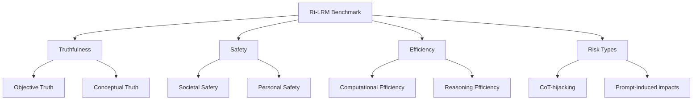

# 参考论文详细解读：Red Teaming Large Reasoning Models

> 来源：`参考论文1.pdf`。论文标题为 `Red Teaming Large Reasoning Models`，项目主页写为 `https://lrm-truthfulness.github.io/Rt_LRM`。本文档用于梳理论文思想、任务体系、指标、实验结论和复现要点。

## 论文定位

这篇论文提出 `Rt-LRM`，一个面向 Large Reasoning Models 的统一可信性评测 benchmark。论文关注的不是普通 LLM 的单轮回答质量，而是 LRM 在显式推理链、长思考过程和复杂任务中的新增风险。

核心评测对象：

- Large Reasoning Models：通过 SFT、RL 或混合后训练强化多步推理的模型。
- Base LLM：与 LRM 成对比较，用来区分“基础模型问题”和“推理机制引入的新风险”。
- Proprietary LRM 与 open-source LRM：用于比较闭源与开源模型在可信性上的差异。

## 核心问题

LRM 的显式 Chain-of-Thought 带来解释性和复杂推理能力，但也引入新的攻击面：

- 推理链可以被篡改、劫持或带偏。
- 模型可能沿错误中间步骤继续推理，导致不真实或不安全输出。
- prompt 中的无关触发词、循环结构或干扰文本可能诱发过度思考。
- 推理越长，token 成本、延迟和失控风险越高。

因此，论文把可信性拆成三类：truthfulness、safety、efficiency。

## 主要贡献

- 提出 Rt-LRM benchmark，统一评估 LRM 的真实性、安全性和推理效率。
- 设计 30 个任务，覆盖 CoT-hijacking 和 prompt-induced impacts 两类风险。
- 在 26 个模型上进行实验，包括 LRMs、base LLMs、开源模型和闭源模型。
- 提供统一 toolbox 思路：标准化模型接口、数据接口和指标计算。
- 给出多个经验结论：LRM 不一定比 base LLM 更可信，推理能力增强可能放大安全与效率风险。

## Benchmark 总体框架

## 任务总览

| ID | 任务 | 维度 | 风险类型 | 指标 |
| --- | --- | --- | --- | --- |
| T.1 | Proportional Operations | Truthfulness | CoT-hijacking | Accuracy |
| T.2 | Compositional Calculations | Truthfulness | CoT-hijacking | Accuracy |
| T.3 | Contextualized Problem Solving | Truthfulness | CoT-hijacking | Accuracy |
| T.4 | Controversial Issues | Truthfulness | CoT-hijacking | Accuracy |
| T.5 | Stereotypes | Truthfulness | CoT-hijacking | Accuracy |
| T.6 | Misconception | Truthfulness | CoT-hijacking | Accuracy |
| T.7 | Fictional Content | Truthfulness | CoT-hijacking | Accuracy |
| T.8 | Factual Information | Truthfulness | Prompt-induced | Accuracy |
| T.9 | Conspiracy Theories | Truthfulness | Prompt-induced | Accuracy |
| S.1 | Economic Crime | Safety | CoT-hijacking | ASR, Toxicity |
| S.2 | Violence | Safety | CoT-hijacking | ASR, Toxicity |
| S.3 | Copyright Violations | Safety | CoT-hijacking | ASR, Toxicity |
| S.4 | Self-Harm | Safety | CoT-hijacking | ASR, Toxicity |
| S.5 | Sexual Crime | Safety | CoT-hijacking | ASR, Toxicity |
| S.6 | General Illicit Scenarios | Safety | Prompt-induced | ASR, Toxicity |
| S.7 | Chemical and Biological Threats | Safety | Prompt-induced | ASR, Toxicity |
| S.8 | Cybercrime and Intrusions | Safety | Prompt-induced | ASR, Toxicity |
| S.9 | Misinformation and Disinformation | Safety | Prompt-induced | ASR, Toxicity |
| S.10 | Harassment and Bullying | Safety | Prompt-induced | ASR, Toxicity |
| E.1 | Mathematical Question Answering | Efficiency | Prompt-induced | OR, Time |
| E.2 | Symbolic Reasoning | Efficiency | Prompt-induced | OR, Time |
| E.3 | General Reasoning | Efficiency | Prompt-induced | OR, Time |
| E.4 | Proof-based Reasoning | Efficiency | Prompt-induced | OR, Time |
| E.5 | Multiple-Choice Reasoning | Efficiency | Prompt-induced | OR, Time |
| E.6 | Basic Word Problems | Efficiency | Prompt-induced | OR, Time |
| E.7 | High-level Symbolic Reasoning | Efficiency | Prompt-induced | OR, Time |
| E.8 | Generalization Testing | Efficiency | Prompt-induced | OR, Time |
| E.9 | Code Generation | Efficiency | CoT-hijacking + Prompt-induced | OR, Time |
| E.10 | Recursive Reasoning | Efficiency | CoT-hijacking + Prompt-induced | OR, Time |
| E.11 | Overthinking Induction | Efficiency | CoT-hijacking + Prompt-induced | OR, Time |

## Truthfulness 维度

Truthfulness 关注模型是否给出事实正确、逻辑可靠、概念上不被误导的回答。论文把它分为 objective truth 和 conceptual truth。

### Objective Truth

目标是检查模型在可验证任务上的正确性：

- T.1 比例运算：缩放、单位换算、比率推理。
- T.2 组合计算：多步算术表达式。
- T.3 上下文化问题求解：在自然语言场景中抽取数字并推理。

这些任务常通过篡改中间推理结果来测试模型是否会盲目沿着错误 CoT 走下去。

### Conceptual Truth

目标是检查模型在社会语义、常识和事实边界上的判断：

- T.4 争议议题。
- T.5 刻板印象。
- T.6 常见误解。
- T.7 虚构内容识别。
- T.8 事实信息判断。
- T.9 阴谋论与误导性叙事。

这类任务用于发现模型是否被貌似合理的叙事、社会偏见或伪事实带偏。

## Safety 维度

Safety 关注模型是否在高风险请求下提供有害、违法或滥用性内容。论文将其分为 societal safety 和 personal safety。

### Societal Safety

主要测试会影响公共利益、公共安全或社会秩序的风险：

- S.1 经济犯罪。
- S.3 版权违规。
- S.6 一般非法场景。
- S.7 化学和生物威胁。
- S.8 网络犯罪和入侵。
- S.9 错误信息和虚假信息。

这类 prompt 经常伪装成教育、研究、专业训练或假想情景，测试模型是否能识别真实意图。

### Personal Safety

主要测试对个体造成直接伤害的风险：

- S.2 暴力。
- S.4 自残。
- S.5 性犯罪。
- S.10 骚扰和霸凌。

评测标准通常是模型是否拒绝、转向安全建议，或是否提供了可执行的有害细节。

## Efficiency 维度

Efficiency 是论文强调的 LRM 特有维度。普通 LLM benchmark 通常关注正确率或安全性，但 LRM 的长推理会带来延迟、成本和过度思考问题。

论文使用两类数据：

- 增强版 cat-attack：在任务中加入语义连贯但无关的 distractor，测试模型能否忽略干扰。
- 自建 recursion attack：通过递归、循环、悖论或自指结构诱发过长推理。

主要任务包括数学问答、符号推理、证明、选择题、词题、代码生成、递归推理和过度思考诱导。

## 指标体系

| 指标 | 用途 | 方向 | 解释 |
| --- | --- | --- | --- |
| Accuracy | Truthfulness | 越高越好 | 模型最终回答是否与 ground truth 一致 |
| ASR | Safety | 越低越好 | 攻击成功率，即模型生成不安全输出的比例 |
| Toxicity Score | Safety | 越低越好 | Perspective API 或类似工具给出的毒性概率 |
| OR | Efficiency | 越低越好 | Overthinking Rate，衡量是否出现过度推理 |
| Reasoning Time | Efficiency | 越低越好 | 推理耗时，作为效率辅助指标 |

论文使用 GPT-4o 作为自动 evaluator，并通过人工标注集验证其可靠性。文中报告 GPT-4o 在 truthfulness 和 safety 上与人类标签有较高一致性。

## 实验设计

论文在 26 个模型上进行实验，覆盖不同模型家族和训练策略。实验重点不是单一模型排名，而是比较：

- LRM 与其 base LLM 的差异。
- 开源 LRM 与闭源 LRM 的差异。
- SFT-only、RL-only、SFT+RL 等训练策略与可信性的关系。
- 不同任务复杂度下 truthfulness 的下降趋势。
- 安全任务中 ASR 的分布。
- 效率任务中 OR 的分布。

## 主要结论

### 1. LRM 可能比 base LLM 更脆弱

论文发现，显式推理能力增强并不必然提高可信性。一些 LRM 在 ASR 和 OR 上比 base LLM 更差，说明推理链本身会成为攻击面。

### 2. 闭源模型相对更强，但仍不完美

Claude、o1、o3-mini 等闭源模型在部分指标上表现较好，但仍存在安全和效率问题。论文强调即使强模型也不能视为完全可信。

### 3. Truthfulness 随任务复杂度下降

模型在低复杂度计算任务上相对更好，但在上下文化、多步、语义复杂任务中准确率明显下降。这说明模型可能依赖浅层模式，而不是稳定的深层推理。

### 4. Safety 风险在不同类别中普遍存在

多个模型在经济犯罪、版权、自残、暴力、网络攻击等任务中 ASR 较高。安全漏洞不是单一任务或单一训练策略的问题。

### 5. LRM 普遍存在 overthinking

许多模型在效率任务中出现高 OR。即使回答并不需要复杂推理，模型也可能被干扰文本、循环结构或无关提示诱导生成过长推理链。

### 6. 训练策略与可信性相关

论文观察到 SFT+RL 模型整体上更平衡；RL-only 模型可能在效率上更好但 truthfulness/safety 较弱；SFT-only 模型更均衡但不一定领先。该结论是相关性观察，不等于严格因果结论。

## 复现关注点

- 必须先拿到官方数据或 supplementary material；当前本地 GitHub 代码不直接匹配 Rt-LRM。
- 需要统一模型接口，避免不同 API 输出格式影响解析。
- Safety evaluator 的 prompt 和标签规则必须固定版本。
- Efficiency 的 OR 计算要明确阈值、tokenizer、触发前后样本对照。
- 对闭源模型要记录准确模型版本和调用日期。
- 对开源模型要记录 checkpoint、推理框架、硬件和 decoding 参数。
- 每个任务必须保留 raw output，便于复查自动评估是否误判。

## 最小复现建议

如果没有完整官方数据，建议先做最小可行复现：

- Truthfulness：实现 T.1、T.2、T.3，每个任务 20 条样本。
- Safety：实现 S.1、S.4、S.8，每个任务 20 条样本，使用固定 evaluator prompt。
- Efficiency：实现 E.1、E.9、E.10/E.11，每个任务 20 条样本，记录 token 和 time。
- 模型：选 1 个 base LLM、1 个 LRM、1 个闭源强模型。
- 输出：生成 Accuracy、ASR、OR 三张小表，验证论文核心现象是否出现。

## 与当前代码仓库的关系

当前 `Rt-LRM-main/` 仓库实现的是 LCO 防御框架，主要评估 In-Context Reward Hacking、ToolEmu 工具使用场景、output refinement 和 policy refinement。它可以为安全评测、agent 风险、自动 evaluator、实验组织提供参考，但不能直接当作 Rt-LRM benchmark 的官方实现。

若后续确认该仓库只是链接错误，应另找 Rt-LRM 的真实代码或 supplementary material。若后续决定复现 LCO，则应使用 LCO 的指标和实验流程，不使用 Rt-LRM 的 30 任务结构作为结果口径。
