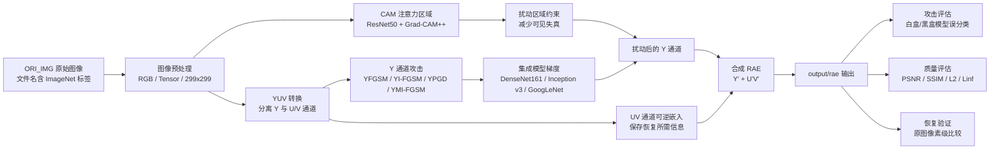
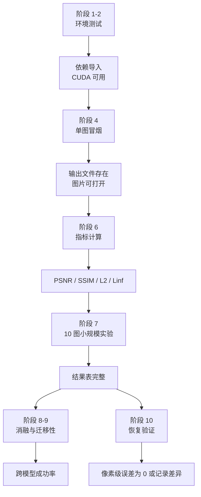

# 架构概览：YUV 可逆对抗攻击复现项目

适用项目：`Efficient and Transferable Reversible Adversarial Attacks Utilizing YUV Color Space`
目标代码目录：`D:\大模型论文复现\yuv-reversible-attack-reproduction`
当前主线依据：清理后的根目录 `README.md`、`项目分阶段执行计划与测试.md`、本文件与 `yuv-reversible-attack-reproduction\runs` 复现实验结果。

## 1. 项目目标

本项目复现一类 error-free reversible adversarial attack。目标不是训练一个新分类模型，而是在预训练图像分类模型上生成可逆对抗样本：

- 对未授权分类模型：图像应尽量被误分类。
- 对授权恢复流程：图像应能从 RAE 恢复为原图。
- 对复现实验：记录攻击成功率、图像质量、运行时间、迁移性和恢复误差。

## 2. 总体数据流



## 3. 目录结构

建议本地结构如下：

```text
D:\大模型论文复现
├─ .gitignore
├─ README.md
├─ 项目分阶段执行计划与测试.md
├─ 架构概览.md
└─ yuv-reversible-attack-reproduction
   ├─ runs
   ├─ pytorch_grad_cam
   ├─ EnModel.py
   ├─ atk.py
   ├─ calMetrics.py
   ├─ embed_utils.py
   ├─ helpers.py
   ├─ reversible_attack_OURS.py
   └─ utils.py
```

说明：

- `ORI_IMG` 是默认输入目录，属于运行时数据，清理后的 Git 仓库不提交。
- `output\rae` 是默认 RAE 输出目录，属于可再生成结果，清理后的 Git 仓库不提交 PNG。
- `runs` 保留已整理的复现实验脚本、CSV 指标和阶段记录。
- 根目录只保留项目入口、架构概览和分阶段执行计划；面向老师回复、Paper 信息复盘、详细论文分析和 agent 规则文件已从 Git 仓库移除。
- `pytorch_grad_cam` 是仓库自带的 Grad-CAM 相关代码，优先视为第三方/内置依赖。

## 4. 核心模块职责

| 模块 | 主要职责 | 复现时关注点 |
|---|---|---|
| `reversible_attack_OURS.py` | 主入口，串联读图、模型、CAM、攻击、嵌入、保存和统计 | 输入目录、输出目录、设备选择、循环参数 |
| `EnModel.py` | 集成多个预训练分类模型，用于提升扰动迁移性 | 模型列表、权重下载、显存占用、`eval()` |
| `atk.py` | 实现攻击方法，重点是 Y 通道攻击变体 | `steps`、扰动约束、梯度更新、momentum |
| `embed_utils.py` | 可逆嵌入和恢复相关工具 | 是否只写入 U/V 通道、恢复信息容量 |
| `calMetrics.py` | 图像质量或扰动指标计算 | PSNR、SSIM、L2、Linf 是否可复用 |
| `utils.py` | 图像/张量转换、颜色空间转换、辅助处理 | RGB/YUV 转换、归一化、尺寸处理 |
| `helpers.py` | 通用辅助函数 | 文件读写、可视化、预处理细节 |
| `pytorch_grad_cam` | CAM 注意力热力图计算 | 版本兼容、目标层、输入尺寸 |

## 5. 运行时组件

| 组件 | 作用 | 典型风险 |
|---|---|---|
| Python 3.10/3.11 | 运行主脚本和工具脚本 | WindowsApps 假 Python |
| PyTorch + torchvision | 加载模型、计算梯度、CUDA 加速 | CPU 版误装、CUDA 版本不匹配 |
| RTX 4060 | 单卡推理和梯度生成 | 集成模型显存占用较高 |
| torchvision 模型权重 | Inception v3、ResNet50、DenseNet161、GoogLeNet 等 | 首次运行需联网下载 |
| Pillow/OpenCV/skimage | 图像读写、指标计算 | BGR/RGB 通道顺序混淆 |

## 6. 输入约定

输入图片默认放在：

```text
yuv-reversible-attack-reproduction\ORI_IMG
```

建议约定：

- 图片为 RGB。
- 初次测试统一为 `299x299`。
- 文件名格式为 `序号_ImageNet标签ID.扩展名`。
- 示例：`0001_281.png`。

标签解析风险：

```text
filename.split('_') -> 取下划线后的标签
```

因此 `cat.png`、`0001-cat.png`、`0001_281_extra.png` 都可能导致脚本解析失败或标签错误。

## 7. 输出约定

默认输出目录：

```text
yuv-reversible-attack-reproduction\output\rae
```

建议扩展输出目录：

```text
runs
├─ 2026-06-09_smoke
│  ├─ command.txt
│  ├─ env.txt
│  ├─ metrics.csv
│  └─ notes.md
└─ 2026-06-09_ablation_y_channel
```

每次实验至少保留：

- 命令。
- 参数。
- 输入图片列表。
- 输出目录。
- 依赖版本。
- 指标表。
- 错误日志或异常记录。

## 8. 攻击与恢复逻辑

论文方法的工程实现可以拆成三个层次：

1. **对抗扰动生成层**
   在 Y 通道生成扰动，通过模型梯度让分类模型误判。

2. **可逆嵌入层**
   将恢复所需的信息嵌入 U/V 通道，避免覆盖已经生成的 Y 通道扰动。

3. **评估验证层**
   同时验证攻击成功、视觉质量、迁移性和像素级恢复。

## 9. 测试架构



## 10. 工程扩展点

优先级从高到低：

1. 增加命令行参数，避免反复手改脚本。
2. 增加 `requirements.txt`，固定已验证依赖。
3. 增加独立 `evaluate_outputs.py`，统一计算指标。
4. 增加 `smoke_test.ps1`，一键跑单图测试。
5. 增加恢复验证脚本，单独验证 error-free recovery。
6. 增加实验配置文件，例如 `configs\smoke.json`、`configs\ablation.json`。

## 11. 已知架构边界

- 当前项目不训练大模型，也不需要 LLM API key。
- 当前仓库已清理为 YUV 可逆对抗攻击复现项目，不保留旧候选论文项目代码。
- README 保持简洁，复现流程主要依赖 `项目分阶段执行计划与测试.md` 与 `runs` 下的阶段记录和结果表。
- 如果完整复现论文表格，需要更多数据、更多模型和更严格的指标统计；单图或 10 图结果只能作为小规模验证。
