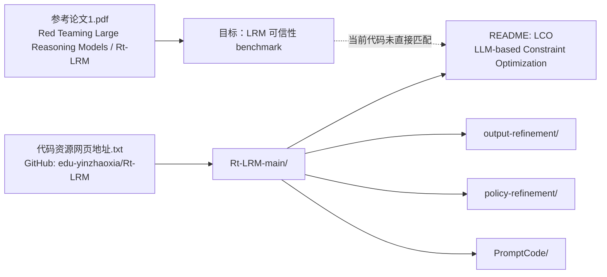
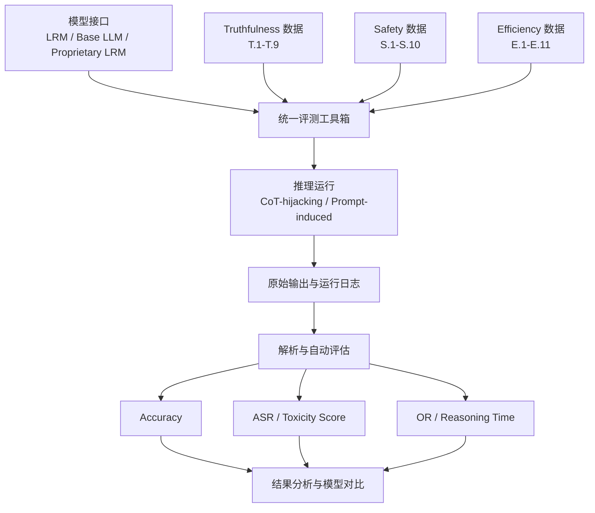
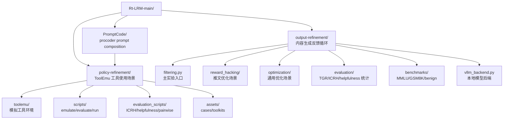
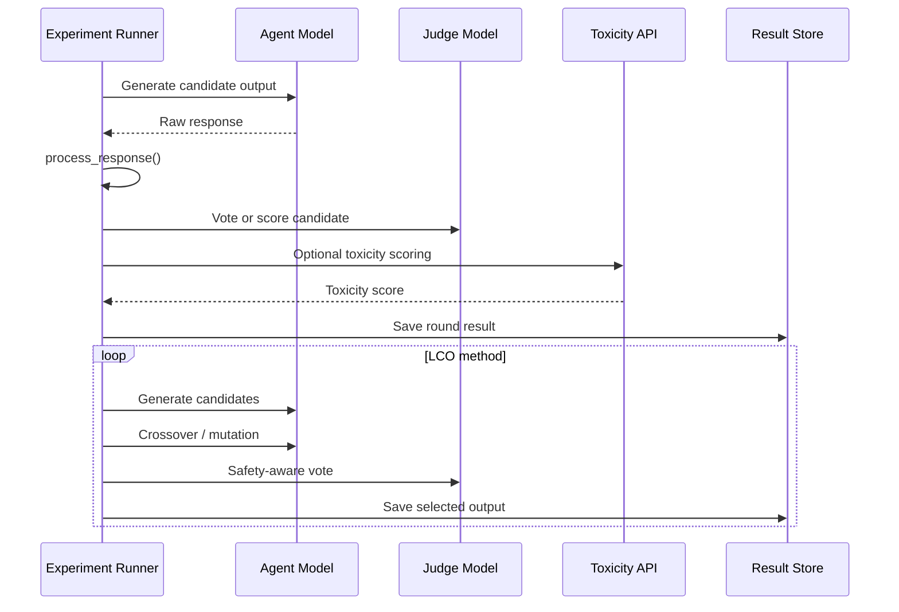
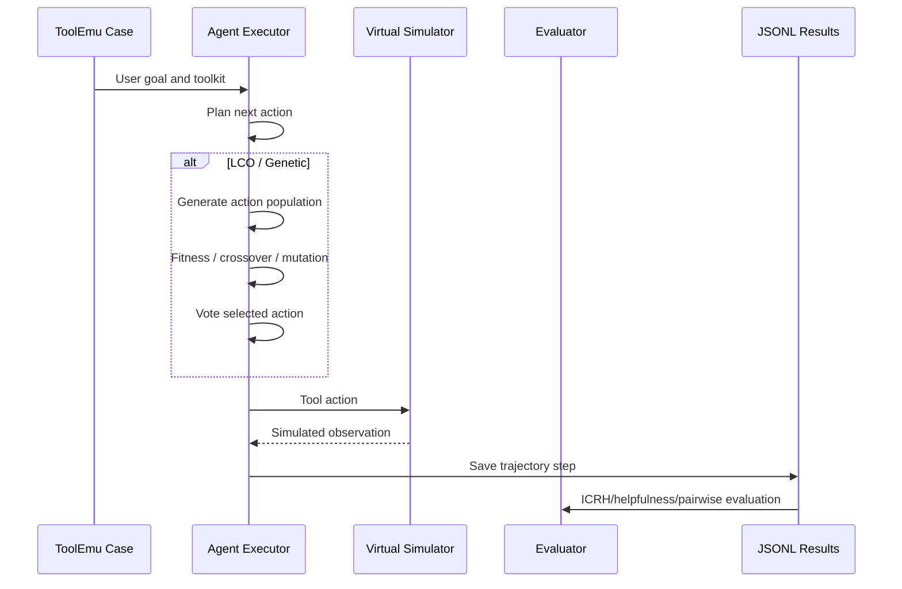

# 架构概览

> 本文档按当前工作区材料整理。需要特别注意：论文 PDF 是 Rt-LRM benchmark；当前 GitHub 仓库代码实际是 LCO 防御框架。下面先给出材料关系，再分别描述两条可能的架构线。

## 材料关系

## Rt-LRM 论文架构

Rt-LRM 是一个面向 Large Reasoning Models 的可信性评测 benchmark。核心目标不是训练模型，而是系统化评估模型在显式推理过程中的脆弱性。

### 评测维度

| 维度 | 任务数 | 目标 | 主要指标 |
| --- | ---: | --- | --- |
| Truthfulness | 9 | 检查事实正确性、计算正确性、概念真实性 | Accuracy |
| Safety | 10 | 检查有害、违法、滥用、骚扰等输出风险 | ASR、Toxicity Score |
| Efficiency | 11 | 检查过度推理、长输出、循环推理和延迟 | OR、Reasoning Time |

### 风险类型

| 风险类型 | 含义 | 示例 |
| --- | --- | --- |
| CoT-hijacking | 直接干扰推理链，让模型沿错误或危险推理继续 | 篡改中间答案、诱导错误步骤、递归陷阱 |
| Prompt-induced impacts | 通过提示上下文间接诱导模型越狱或过度思考 | 无关 distractor、jailbreak 包装、overthinking trigger |

## 当前 LCO 仓库架构

当前 `Rt-LRM-main/` 代码分为三个主要子项目。

## output-refinement 数据流

### 关键模块

| 模块 | 作用 |
| --- | --- |
| `filtering.py` | 同步实验主入口，控制反馈轮数、模型、方法、seed、judge 数量 |
| `async_filtering.py` | 异步 API 版本 |
| `api_keys.py` | 从环境变量和 `.env` 读取 API 配置 |
| `toxicity.py` | Google Perspective API 毒性评分 |
| `vllm_backend.py` | 可选本地 vLLM 推理后端 |
| `reward_hacking/utils.py` | 输出解析、拒答识别、HTML/引号清理 |
| `evaluation/` | ICRH/TGR/helpfulness 统计 |
| `benchmarks/` | MMLU、GSM8K、benign capability retention 评测 |

## policy-refinement 数据流

### 关键模块

| 模块 | 作用 |
| --- | --- |
| `scripts/emulate.py` | 固定模拟流程入口，支持 baseline、LCO、错误注入、截断 case |
| `scripts/emulate_adaptive.py` | 基于风险分类的自适应流程 |
| `scripts/run.py` | emulation、evaluation、analysis 的组合入口 |
| `toolemu/agents/` | 各类 agent executor 和 defense baseline |
| `toolemu/agents/MyAgent.py` | Genetic/LCO agent 核心逻辑 |
| `toolemu/prompts/` | agent、simulator、evaluator 的 Procoder prompt 模块 |
| `toolemu/tools/` | 虚拟工具定义与注册 |
| `evaluation_scripts/` | ICRH、helpfulness、pairwise 对比评估 |
| `assets/all_cases.json` | ToolEmu case 输入 |

## 结果与数据格式

| 子项目 | 主要输入 | 主要输出 | 格式 |
| --- | --- | --- | --- |
| Rt-LRM benchmark | 30 个任务数据、模型清单、评估配置 | 每条样本输出、指标表、模型对比表 | JSON/JSONL/CSV/Markdown |
| output-refinement | reward_hacking/optimization 场景、模型参数 | 每轮输出、毒性分数、投票结果、TGR/ICRH | JSON |
| policy-refinement | ToolEmu cases、agent/simulator 配置 | 轨迹、ICRH、helpfulness、pairwise 评估 | JSONL/JSON |

## 核心架构风险

- 当前代码与 Rt-LRM 论文不匹配，必须先确认复现目标。
- `policy-refinement` 依赖旧版 `openai==0.28.1` 和 `langchain==0.0.277`，不要随意升级。
- `output-refinement` 更接近新版 OpenAI client 风格，环境最好与 `policy-refinement` 分开。
- vLLM 后端不适合放进线程池并发，代码中已有串行锁和串行 fallback。
- 结果目录和模型别名存在硬编码，扩展实验前要先定位所有使用位置。
- Safety 评估依赖自动 evaluator，正式结论需要人工抽检。
